# Movie Metadata Analysis

The Movie Metadata Analysis project leverages machine learning to predict the release year of a director's next movie and its probable genres. The project covers extensive data cleaning, feature engineering, visualization, modeling, and evaluation.

## Table of Contents

- [Project Overview](#project-overview)
- [Features](#features)
- [Data Description](#data-description)
- [Installation](#installation)
- [Usage](#usage)
- [Analysis](#analysis)
  - [Data Cleaning](#data-cleaning)
  - [Feature Engineering](#feature-engineering)
  - [Visualization](#visualization)
  - [Modeling](#modeling)
  - [Results](#results)
- [Conclusion](#conclusion)
- [Contributing](#contributing)
- [License](#license)
- [Contact](#contact)

## Project Overview

This project utilizes a comprehensive dataset to analyze and predict key aspects of future movies based on a director's past works. It encompasses all aspects of a data science project, from cleaning to feature engineering and modeling.

## Features

- **Data Cleaning**: Resolves missing data issues using effective imputation strategies.
- **Feature Engineering**: Creates binary features for genres and calculates relevant statistics for directors.
- **Data Visualization**: Provides various visualizations to understand the data better.
- **Predictive Modeling**: Develops machine learning models for regression and classification.

## Data Description

The original dataset is a comprehensive collection of metadata for movies. It contains 28 columns and 5,043 entries, each representing different aspects of a movie, such as its title, director, and financial performance. The following is a brief overview of the dataset:

- **Columns:** The dataset contains various attributes of a movie, including:
   - `color`: Indicates whether the movie is in color or black-and-white.
   - `director_name`: The name of the movie's director.
   - `num_critic_for_reviews`: The number of critic reviews received.
   - `duration`: The duration of the movie in minutes.
   - `gross`: The gross earnings of the movie.
   - `genres`: The genres associated with the movie.
   - `title_year`: The year the movie was released.
   - `imdb_score`: The IMDb rating of the movie.

- **Data Quality:** Some columns contain missing values, including `color`, `director_name`, `gross`, `content_rating`, `budget`, and `title_year`.

- **Data Types:** The dataset includes a mix of categorical and numerical data:
   - Categorical columns: `color`, `director_name`, `genres`, `movie_title`, `language`, `country`, `content_rating`, and `movie_imdb_link`.
   - Numerical columns: `num_critic_for_reviews`, `duration`, `gross`, `num_voted_users`, `cast_total_facebook_likes`, `facenumber_in_poster`, `num_user_for_reviews`, `budget`, `title_year`, `imdb_score`, `aspect_ratio`, and `movie_facebook_likes`.

## Installation


To set up the project locally:

1. **Clone the repository**:

   ```bash
   git clone https://github.com/ascender1729/CDS-IISC-P1-DataSci-PreDoc.git
   ```

2. **Navigate to the project directory**:

   ```bash
   cd CDS-IISC-P1-DataSci-PreDoc
   ```

3. **Create a virtual environment and install dependencies**:

   ```bash
   python -m venv env
   source env/bin/activate
   pip install -r requirements.txt
   ```


## Usage

1. Activate the virtual environment:
   - On Windows: `.\env\Scripts\activate`
   - On macOS/Linux: `source env/bin/activate`

2. Run the Jupyter notebook:
   ```bash
   jupyter notebook
   ```

3. Open and execute the cells in the relevant notebook.

## Analysis

### Data Cleaning

The enhanced dataset addressed missing values in both numerical and categorical columns using the following approaches:

- **Numerical columns:** Missing values were filled with their median values, maintaining the central tendency of the data.
- **Categorical columns:** Missing values were filled with their mode values or placeholders where appropriate, depending on the context.

### Feature Engineering

New features were engineered to enhance the predictive models:

- **Binary features for each genre:** Binary features were created for each genre, allowing for multi-label classification of movies based on their genres.
- **Director-specific features:** Features such as average release intervals, average gross earnings, and intervals between consecutive releases were calculated to provide insights into a director’s typical behavior and success.

### Visualization

To better understand the data, various visualizations were used:

<table>
  <tr>
    <td><b>Correlation Heatmap</b></td>
    <td><b>Distribution of director name</b></td>
    <td><b>Distribution of content rating</b></td>
  </tr>
  <tr>
    <td></td>
    <td>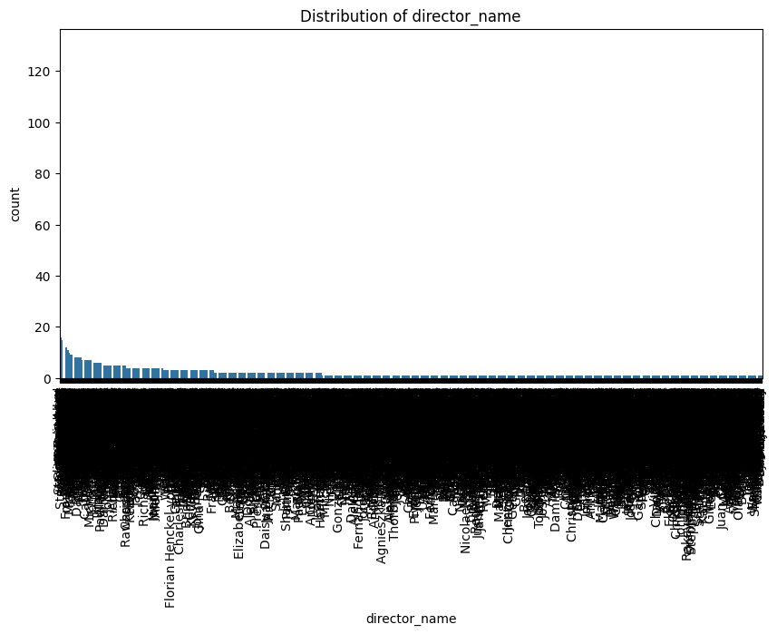</td>
    <td>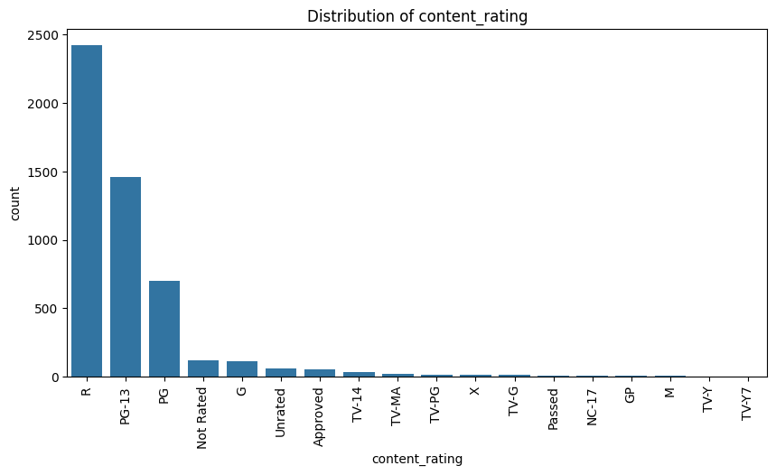</td>
  </tr>
  <tr>
    <td><b>Distribution of Color</b></td>
    <td><b>Distribution of language</b></td>
    <td><b>Distribution of country</b></td>
  </tr>
  <tr>
    <td>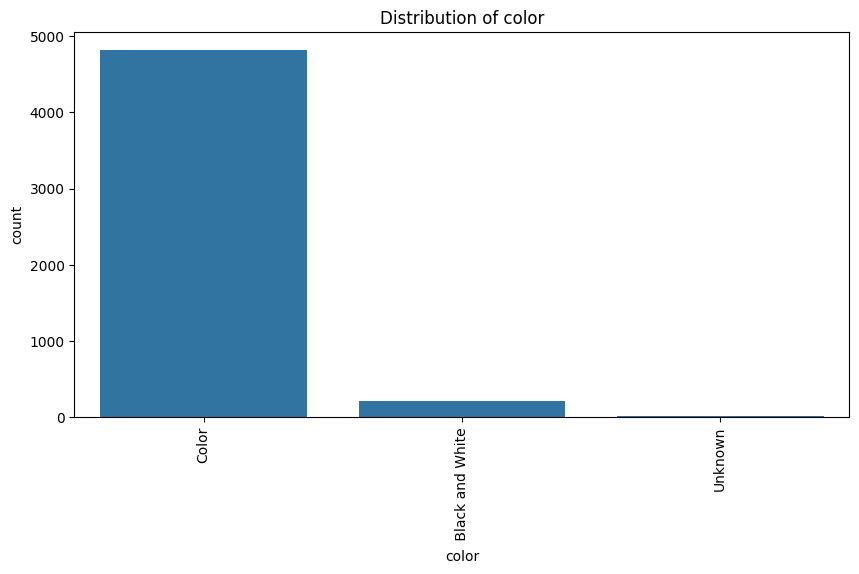</td>
    <td>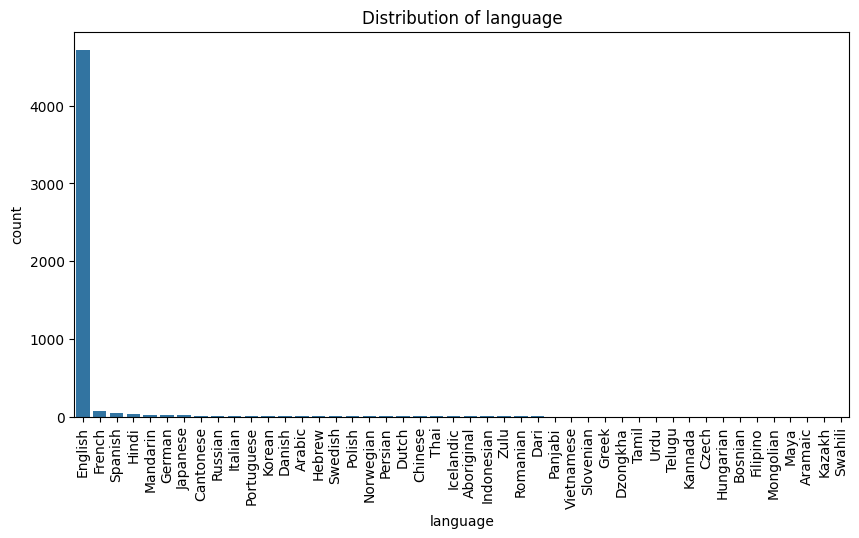</td>
    <td>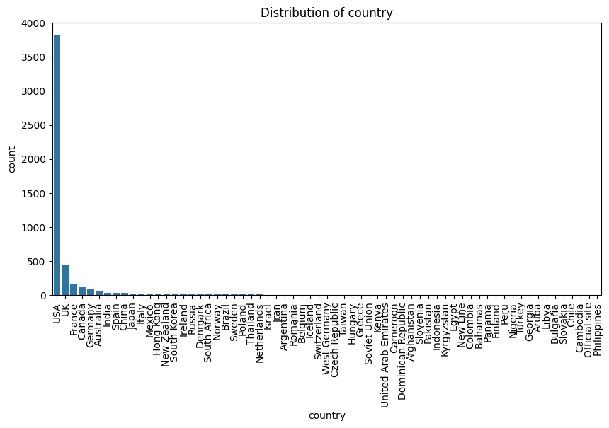</td>
  </tr>
  <tr>
    <td><b>Scatter Plot: duration vs gross</b></td>
    <td><b>Scatter Plot: budget vs gross</b></td>
    <td><b>Scatter Plot: title year vd gross </b></td>
  </tr>
  <tr>
    <td>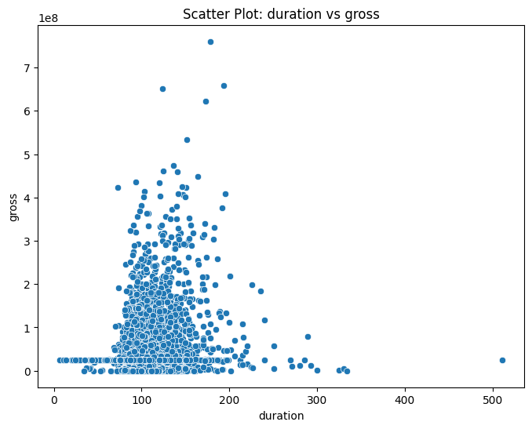</td>
    <td>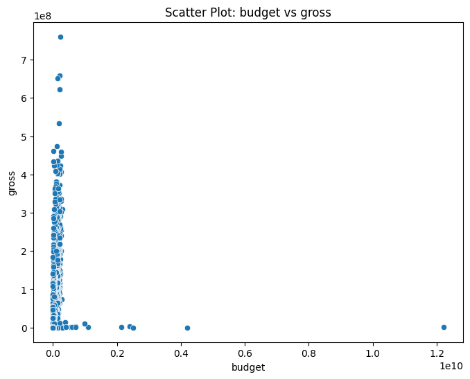</td>
    <td>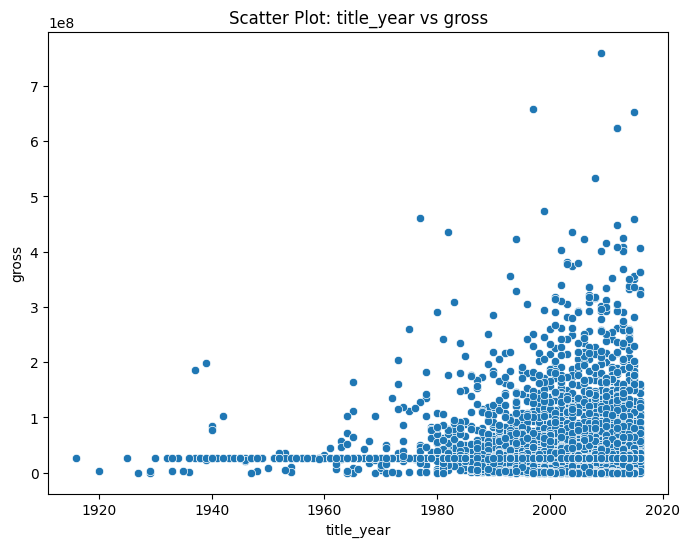</td>
  </tr>
  <tr>
    <td><b>Scatter Plot: actor 1 fb likes vs gross</b></td>
    <td><b>Scatter Plot: actor 2 fb likes vs gross </b></td>
    <td><b>Scatter Plot: actor 3 fb likes vs gross</b></td>
  </tr>
  <tr>
    <td></td>
    <td></td>
    <td></td>
  </tr>
</table>


## Modeling

The project involved two predictive models for distinct yet related objectives:

#### Release Year Prediction

To predict the release year of a director's next movie, a Gradient Boosting Regressor was utilized. This method was chosen for its ability to handle complex relationships and its effectiveness in regression tasks. The following steps were taken:

1. **Feature Selection**: 
   - The relevant features, such as `average_gross`, `average_release_interval`, and `director_facebook_likes`, were identified to focus the model on the most impactful variables.

2. **Hyperparameter Tuning**:
   - The Gradient Boosting Regressor was fine-tuned using Grid Search Cross-Validation to identify the best combination of hyperparameters.
   - Parameters such as `n_estimators`, `max_depth`, and `learning_rate` were varied to improve the model's predictive performance.

3. **Cross-Validation**:
   - The model's robustness was tested using cross-validation, ensuring that the selected hyperparameters provided consistent performance across different data subsets.

#### Genre Prediction

For the multi-label classification task of predicting a movie's genres, the Classifier Chain method was employed. This method enables chaining together classifiers to handle multiple labels simultaneously. The approach included the following steps:

1. **Model Selection**:
   - The Classifier Chain was combined with a Voting Classifier, which used ensemble methods like Random Forest and XGBoost. This ensemble approach leverages the strengths of both models to improve overall performance.

2. **Training**:
   - The Voting Classifier was trained using the `soft` voting strategy, which considers the probability outputs of each model to make final predictions. This approach often results in higher accuracy, particularly for multi-label problems.

3. **Evaluation**:
   - The Classifier Chain was evaluated using several key metrics, including F1 score, accuracy, precision, recall, and Hamming loss.
   - These metrics provided a comprehensive view of the model's effectiveness in predicting multiple genres simultaneously.


## Results

### Release Year Prediction

- The Gradient Boosting Regressor achieved a mean absolute error (MAE) of 5.94465 and an R-squared value (R²) of 0.469028.
- The model's cross-validation scores varied between 0.33920605 and 0.46901381, with a mean score of 0.40512641961070217.
- These results indicate that the model performs reasonably well in predicting the release year.

### Genre Prediction

- The Classifier Chain model achieved an F1 score of 0.465631, an accuracy of 0.120912, a precision of 0.602423, and a recall of 0.379466.
- The Hamming loss for the model was 0.0957155, showcasing the model's efficacy in multi-label classification.
  
- Confusion matrices were generated for each genre to further analyze the model's performance. The visualizations are presented below:

<table>
  <tr>
    <td>1. Game Show</td>
    <td>2. Crime</td>
    <td>3. Animation</td>
  </tr>
  <tr>
    <td>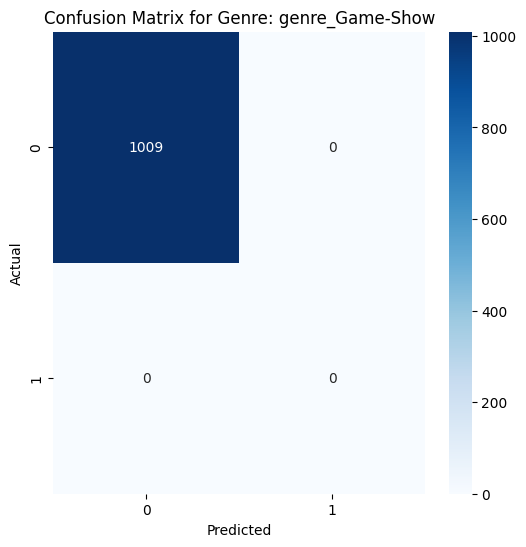</td>
    <td>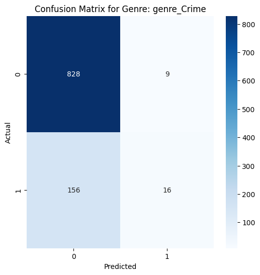</td>
    <td></td>
  </tr>
  <tr>
    <td>4. Comedy</td>
    <td>5. Short</td>
    <td>6. Documentary</td>
  </tr>
  <tr>
    <td>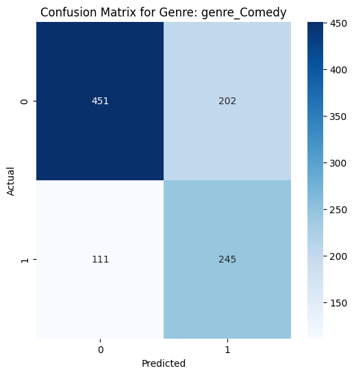</td>
    <td></td>
    <td>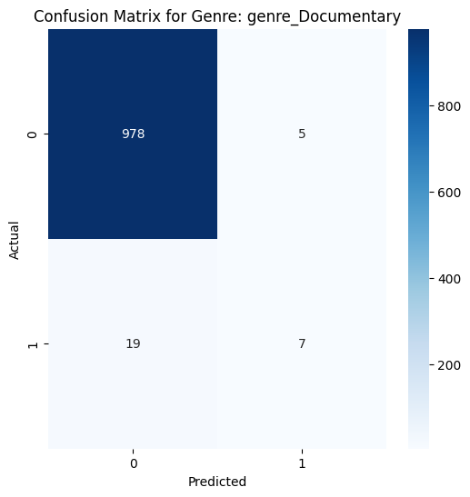</td>
  </tr>
  <tr>
    <td>7. Drama</td>
    <td>8. Film-Noir</td>
    <td>9. Music</td>
  </tr>
  <tr>
    <td>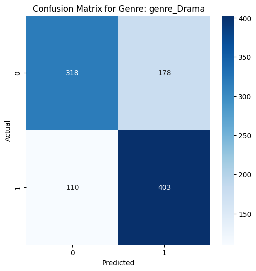</td>
    <td></td>
    <td></td>
  </tr>
  <tr>
    <td>10. Thriller</td>
    <td>11. Romance</td>
    <td>12. News</td>
  </tr>
  <tr>
    <td>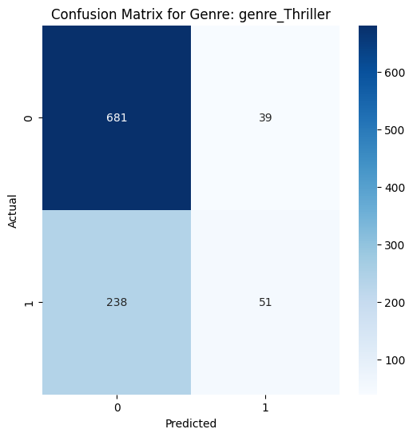</td>
    <td>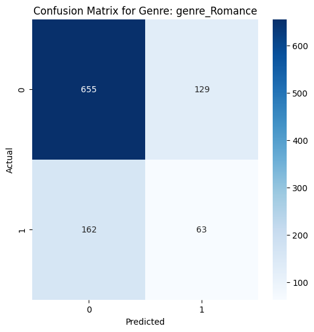</td>
    <td></td>
  </tr>
  <tr>
    <td>13. Musical</td>
    <td>14. Action</td>
    <td>15. Adventure</td>
  </tr>
  <tr>
    <td></td>
    <td></td>
    <td>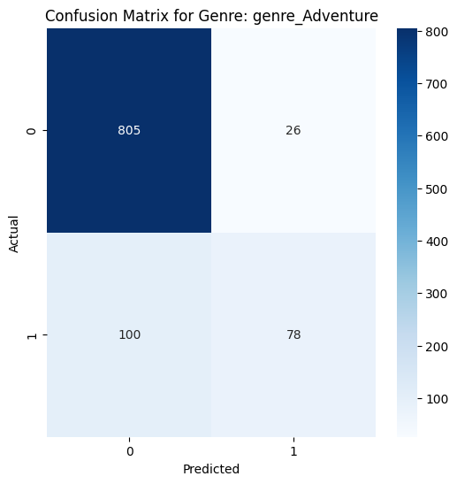</td>
  </tr>
  <tr>
    <td>16. War</td>
    <td>17. Mystery</td>
    <td>18. Fantasy</td>
  </tr>
  <tr>
    <td></td>
    <td>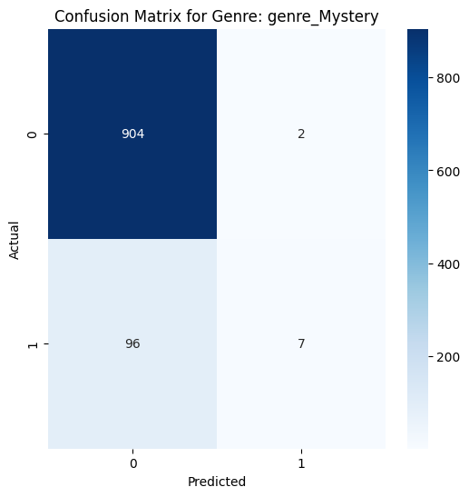</td>
    <td>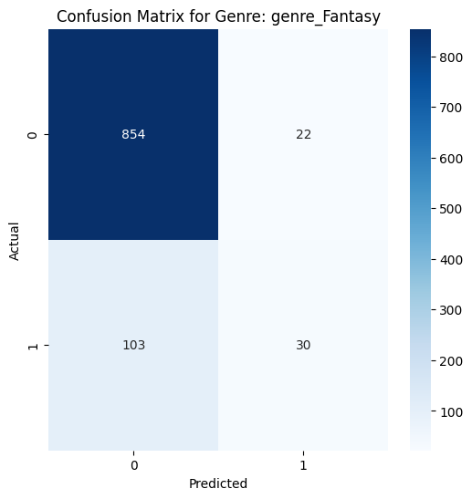</td>
  </tr>
  <tr>
    <td>19. Reality TV</td>
    <td>20. Biography</td>
    <td>21. Family</td>
  </tr>
  <tr>
    <td></td>
    <td></td>
    <td>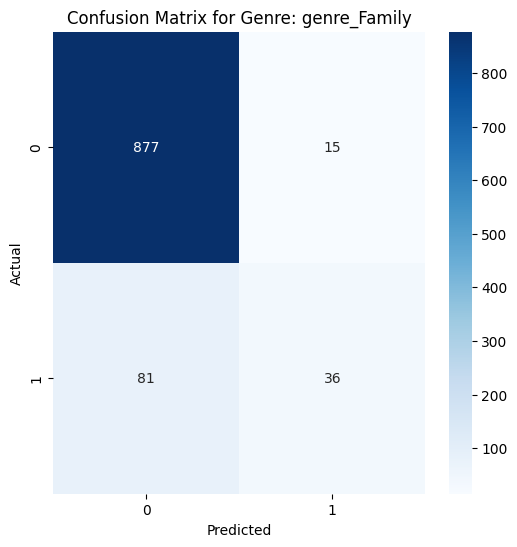</td>
  </tr>
  <tr>
    <td>22. Western</td>
    <td>23. Horror</td>
    <td>24. Sci-Fi</td>
  </tr>
  <tr>
    <td>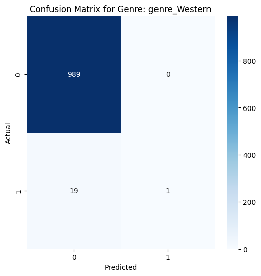</td>
    <td>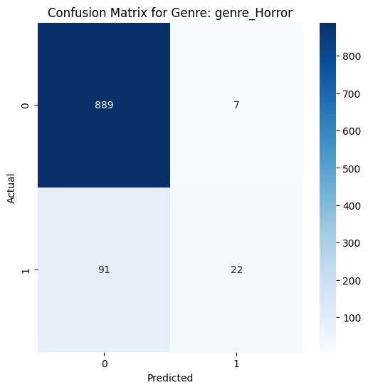</td>
    <td>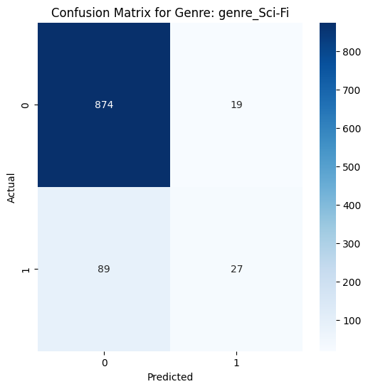</td>
  </tr>
  <tr>
    <td>25. History</td>
    <td>26. Sport</td>
    <td></td>
  </tr>
  <tr>
    <td></td>
    <td></td>
    <td></td>
  </tr>
</table>


### Evaluation Metrics

Below is a table summarizing the model evaluation metrics:

| Model                                | Metric                    |      Score |
|--------------------------------------|---------------------------|------------|
| Gradient Boosting Regressor          | Mean Absolute Error (MAE) |    5.94465 |
| Gradient Boosting Regressor          | Mean Squared Error (MSE)  |   86.0554  |
| Gradient Boosting Regressor          | R-Squared (R²)            |   0.469028 |
| Classifier Chain (Voting Classifier) | F1 Score                  |   0.465631 |
| Classifier Chain (Voting Classifier) | Accuracy                  |  0.120912  |
| Classifier Chain (Voting Classifier) | Hamming Loss              |  0.0957155 |
| Classifier Chain (Voting Classifier) | Precision                 |   0.602423 |
| Classifier Chain (Voting Classifier) | Recall                    |   0.379466 |


## Conclusion

The Movie Metadata Analysis project successfully developed predictive models for both the release year and genres of future movies directed by the same individual. The enhanced dataset, after thorough cleaning and feature engineering, provided robust insights for analysis and model building. The models achieved reasonable accuracy and were evaluated using various metrics to assess their performance comprehensively.

## Contributing

Contributions are welcome to extend the project or improve the existing methodologies.

## License

This project is licensed under the MIT License - see the `LICENSE` file for details.

## Contact

Pavan Kumar - pavankumard.pg19.ma@nitp.ac.in

LinkedIn: [@ascender1729](https://www.linkedin.com/in/im-pavankumar/)

Project Link: [CDS-IISC-P1-DataSci-PreDoc](https://github.com/ascender1729/CDS-IISC-P1-DataSci-PreDoc)
