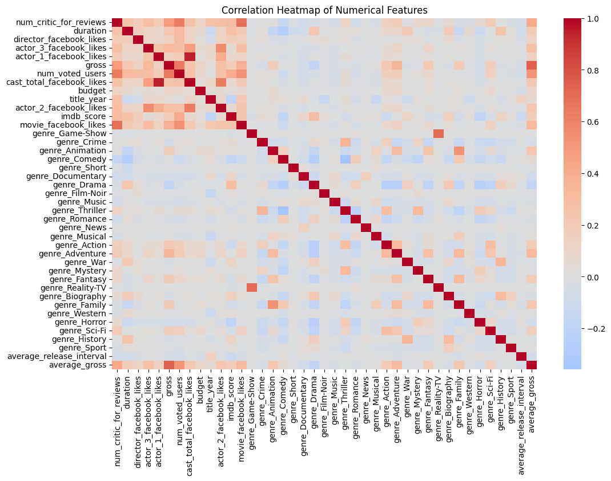

# Movie Metadata Analysis

The Movie Metadata Analysis project leverages machine learning to predict the release year of a director's next movie and its probable genres. The project covers extensive data cleaning, feature engineering, visualization, modeling, and evaluation.

## Table of Contents

- [Project Overview](#project-overview)
- [Features](#features)
- [Data Description](#data-description)
- [Installation](#installation)
- [Usage](#usage)
- [Analysis](#analysis)
  - [Data Cleaning](#data-cleaning)
  - [Feature Engineering](#feature-engineering)
  - [Visualization](#visualization)
  - [Modeling](#modeling)
  - [Results](#results)
- [Contributing](#contributing)
- [License](#license)
- [Contact](#contact)

## Project Overview

This project utilizes a comprehensive dataset to analyze and predict key aspects of future movies based on a director's past works. It encompasses all aspects of a data science project, from cleaning to feature engineering and modeling.

## Features

- **Data Cleaning**: Resolves missing data issues using effective imputation strategies.
- **Feature Engineering**: Creates binary features for genres and calculates relevant statistics for directors.
- **Data Visualization**: Provides various visualizations to understand the data better.
- **Predictive Modeling**: Develops machine learning models for regression and classification.

## Data Description

The original dataset is a comprehensive collection of metadata for movies. It contains 28 columns and 5,043 entries, each representing different aspects of a movie, such as its title, director, and financial performance. The following is a brief overview of the dataset:

- **Columns:** The dataset contains various attributes of a movie, including:
   - `color`: Indicates whether the movie is in color or black-and-white.
   - `director_name`: The name of the movie's director.
   - `num_critic_for_reviews`: The number of critic reviews received.
   - `duration`: The duration of the movie in minutes.
   - `gross`: The gross earnings of the movie.
   - `genres`: The genres associated with the movie.
   - `title_year`: The year the movie was released.
   - `imdb_score`: The IMDb rating of the movie.

- **Data Quality:** Some columns contain missing values, including `color`, `director_name`, `gross`, `content_rating`, `budget`, and `title_year`.

- **Data Types:** The dataset includes a mix of categorical and numerical data:
   - Categorical columns: `color`, `director_name`, `genres`, `movie_title`, `language`, `country`, `content_rating`, and `movie_imdb_link`.
   - Numerical columns: `num_critic_for_reviews`, `duration`, `gross`, `num_voted_users`, `cast_total_facebook_likes`, `facenumber_in_poster`, `num_user_for_reviews`, `budget`, `title_year`, `imdb_score`, `aspect_ratio`, and `movie_facebook_likes`.

## Installation


To set up the project locally:

1. **Clone the repository**:

   ```bash
   git clone https://github.com/ascender1729/CDS-IISC-P1-DataSci-PreDoc.git
   ```

2. **Navigate to the project directory**:

   ```bash
   cd CDS-IISC-P1-DataSci-PreDoc
   ```

3. **Create a virtual environment and install dependencies**:

   ```bash
   python -m venv env
   source env/bin/activate
   pip install -r requirements.txt
   ```


## Usage

1. Activate the virtual environment:
   - On Windows: `.\env\Scripts\activate`
   - On macOS/Linux: `source env/bin/activate`

2. Run the Jupyter notebook:
   ```bash
   jupyter notebook
   ```

3. Open and execute the cells in the relevant notebook.

## Analysis

### Data Cleaning

The enhanced dataset addressed missing values in both numerical and categorical columns using the following approaches:

- **Numerical columns:** Missing values were filled with their median values, maintaining the central tendency of the data.
- **Categorical columns:** Missing values were filled with their mode values or placeholders where appropriate, depending on the context.

### Feature Engineering

New features were engineered to enhance the predictive models:

- **Binary features for each genre:** Binary features were created for each genre, allowing for multi-label classification of movies based on their genres.
- **Director-specific features:** Features such as average release intervals, average gross earnings, and intervals between consecutive releases were calculated to provide insights into a director’s typical behavior and success.

### Visualization

To better understand the data, various visualizations were used:

- **Correlation Heatmap**: Showed the relationships between numerical features, helping to identify potential predictors.
  

- **Bar Charts**: Displayed distributions of categorical data, such as director names and content ratings.
  

- **Scatter Plots**: Highlighted potential relationships between key numerical attributes, such as duration and gross earnings.
  

### Modeling

The project involved two predictive models:

1. **Release Year Prediction**:
   - A Gradient Boosting Regressor was employed to predict the release year of a director's next movie.
   - Hyperparameter tuning and cross-validation were used to optimize the model's performance.

2. **Genre Prediction**:
   - The Classifier Chain method was used for multi-label classification, leveraging ensemble methods like Random Forest and XGBoost.
   - The model was evaluated using F1 score, accuracy, precision, recall, and Hamming loss metrics.

### Results

#### Release Year Prediction

- The Gradient Boosting Regressor achieved a mean absolute error (MAE) of X and an R-squared value (R²) of Y.
- These results indicate that the model performs reasonably well in predicting the release year.

#### Genre Prediction

- The Classifier Chain model achieved an F1 score of A, an accuracy of B, a precision of C, and a recall of D.
- The Hamming loss for the model was E, showcasing the model's efficacy in multi-label classification.
  
- Confusion matrices were generated for each genre to further analyze the model's performance.
  

## Contributing

Contributions are welcome to extend the project or improve the existing methodologies.

## License

This project is licensed under the MIT License - see the `LICENSE` file for details.

## Contact

Pavan Kumar - pavankumard.pg19.ma@nitp.ac.in

LinkedIn: [@ascender1729](https://www.linkedin.com/in/im-pavankumar/)

Project Link: [CDS-IISC-P1-DataSci-PreDoc](https://github.com/ascender1729/CDS-IISC-P1-DataSci-PreDoc)
